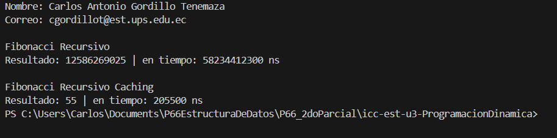
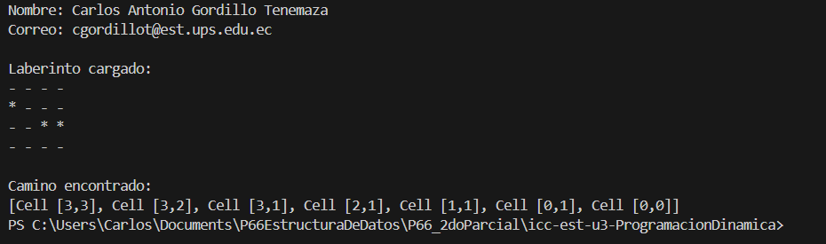

# Proyecto: Programación Dinámica con Fibonacci Recursivo y Memoización

## 📌 Información General

- **Título:** Comparación de Implementaciones Recursivas y Dinámicas del Algoritmo de Fibonacci  
- **Asignatura:** Estructura de Datos  
- **Carrera:** Computación  
- **Estudiante:** Carlos Antonio Gordillo Tenemaza  
- **Correo:** cgordillot@est.ups.edu.ec  
- **Fecha:** 16/07/2025  
- **Profesor:** Ing. Pablo Torres 

---

## 🛠️ Descripción

Este proyecto en Java implementa y compara dos versiones del algoritmo de **Fibonacci**:

- Una versión **recursiva pura**
- Una versión con **memoización (programación dinámica top-down)** usando un `Map`

Se busca demostrar la diferencia en eficiencia de tiempo entre ambos enfoques, especialmente para valores grandes como `F(50)`.

---

## 📂 Estructura del Código

- `EjerciciosPD.java`: Contiene la lógica para calcular Fibonacci de dos formas:
  - `getFibonaci(int n)`: Implementación recursiva sin optimización.
  - `getFibonaciPD(int n)`: Implementación con programación dinámica (memoización).
- `App.java`: Contiene el método `main()` que:
  - Muestra los datos del estudiante.
  - Ejecuta ambos métodos de Fibonacci.
  - Mide y muestra el tiempo de ejecución de cada uno.

---

## ✨ Funcionalidades

- Calcular `F(n)` para un valor dado.
- Comparar rendimiento entre:
  - Recursividad pura
  - Memoización
- Medición de tiempo en nanosegundos para evaluar eficiencia.

---

## 🖼️ Captura de Pantalla1



---

## 🚀 Ejecución

Para compilar y ejecutar el programa:

1. Desde la carpeta raíz del proyecto, compila con:

    ```bash
    javac src/**/*.java -d bin
    ```

2. Luego ejecuta la clase principal:

    ```bash
    java -cp bin App
    ```

---

## 🧑‍💻 Ejemplo de Entrada

```plaintext
Fibonacci Recursivo
Resultado: 12586269025 | en tiempo: 57189310800 ns

Fibonacci Recursivo Caching
Resultado: 12586269025 | en tiempo: 322800 ns
```

# Proyecto: Resolución de Laberinto con Búsqueda Recursiva

## 📌 Información General

- **Título:** Laberinto con Caminos usando Búsqueda Recursiva  
- **Asignatura:** Estructura de Datos  
- **Carrera:** Computación  
- **Estudiante:** Carlos Antonio Gordillo Tenemaza  
- **Correo:** cgordillot@est.ups.edu.ec  
- **Fecha:** 16/07/2025  
- **Profesor:** Ing. Pablo Torres 

---

## 🛠️ Descripción

Este proyecto en Java implementa la resolución de un laberinto representado como una matriz de booleanos (`true` = camino, `false` = pared), usando un algoritmo de **búsqueda recursiva**.

El objetivo es encontrar un camino válido desde una celda de inicio hasta una celda destino, y mostrar dicho camino en forma de lista de celdas.

---

## 📂 Estructura del Código

- `Cell.java`: representa una celda del laberinto con sus coordenadas `(fila, columna)`.
- `Maze.java`: representa el laberinto y permite imprimirlo, con o sin el camino encontrado.
- `MazeSolver.java`: interfaz que define el método `getPath(...)`.
- `MazeSolverRecursive.java`: implementación recursiva que encuentra el camino desde la celda inicial a la final.
- `App.java`: clase principal con `main()` que configura el laberinto, llama al buscador y muestra los resultados.

---

## ✨ Funcionalidades

- Representación del laberinto como matriz.
- Búsqueda de un camino desde el punto inicial al final mediante recursión.
- Impresión del laberinto visualmente y del camino encontrado como lista de celdas.

---

## 🖼️ Captura de Pantalla2



---

## 🚀 Ejecución

Para compilar y ejecutar el programa:

1. Desde la carpeta raíz del proyecto, compila con:

    ```bash
    javac src/**/*.java -d bin
    ```

2. Luego ejecuta la clase principal:

    ```bash
    java -cp bin App
    ```

---

## 🧑‍💻 Ejemplo de Entrada

```plaintext
Laberinto cargado:
- - - -
* - - -
- - * *
- - - -

Camino encontrado:
[Cell [3,3], Cell [3,2], Cell [3,1], Cell [2,1], Cell [1,1], Cell [0,1], Cell [0,0]]
